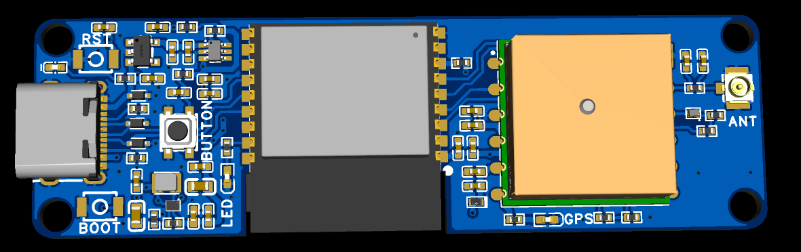
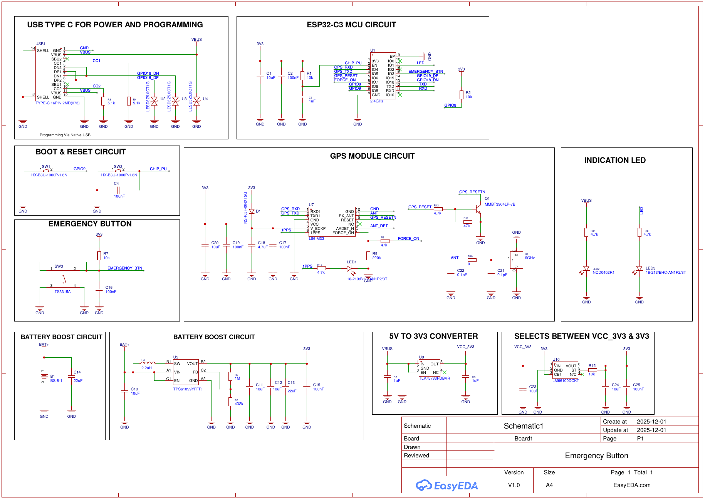
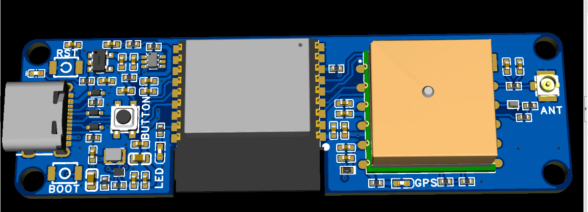
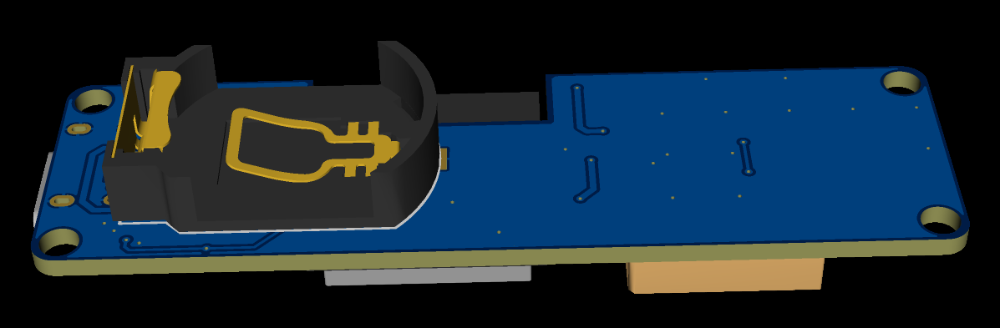

# Emergency Button

ESP32-C3 board with an L86 GNSS module, a single emergency push button, and coin cell or USB-C power. Designed in EasyEDA Pro, revision V1.0 (2025-12-01).

## Specifications

| Item | Part |
| --- | --- |
| MCU | ESP32-C3-WROOM-02-N4 (U1) |
| GNSS | Quectel L86-M33 (U7), patch antenna plus U.FL connector (U8) |
| Battery boost | TI TPS61099 (U5), 3.3 V output |
| USB regulator | TI TLV75733P (U9), 5 V to 3.3 V |
| Power path | TI LM66100 ideal diode (U10) |
| Battery | Coin cell, BS-8-1 holder (B1) |
| Connector | USB-C, power and programming |
| Inputs | Emergency button (SW3), BOOT (SW1), RESET (SW2) |
| Indicators | Power LED (LED2), user LED (LED3), GNSS 1PPS LED (LED1) |

## Design Notes

- Programming uses the ESP32-C3 native USB Serial/JTAG on GPIO18/GPIO19. No USB-to-UART bridge is required.
- USB-C sink configuration uses 5.1 kΩ pull-downs on CC1 and CC2 (R3, R4). D+, D-, and VBUS have ESD protection (U2 to U4).
- The GNSS backup supply (V_BCKP) is fed from 3.3 V through a Schottky diode (D1) with a 4.7 µF hold-up capacitor (C18). This retains backup data across brief supply interruptions and supports hot start.
- GNSS reset is driven through an NPN transistor (Q1) in open-collector configuration. The MCU never drives the module reset pin directly.
- The emergency button is debounced in hardware with a 10 kΩ pull-up and 100 nF capacitor (R7, C16).
- The U.FL antenna path includes a pi-match footprint (R10, C21, C22) for tuning.

## MCU Pin Assignment

| GPIO | Function |
| --- | --- |
| IO1 | User LED |
| IO3 | Emergency button |
| IO4 | GNSS RXD |
| IO5 | GNSS TXD |
| IO6 | GNSS reset |
| IO7 | GNSS FORCE_ON |
| IO8 | Strapping, 10 kΩ pull-up |
| IO9 | BOOT button |
| IO18 / IO19 | USB D- / D+ |
| EN | RESET button, RC delay (R1, C3) |

## Schematic

PDF: [schematic/schematic.pdf](schematic/schematic.pdf)

## Board

| Top | Bottom |
| --- | --- |
|  |  |

## Repository Contents

| Path | Contents |
| --- | --- |
| `schematic/` | Schematic (PDF) |
| `source/` | EasyEDA Pro project file (.epro) |
| `fabrication/` | Gerber files, bill of materials, pick-and-place |
| `3d/` | STEP model |
| `images/` | Renders and schematic image |

## Manufacturing

The BOM uses LCSC part numbers. Upload `fabrication/gerber.zip`, `fabrication/bom.csv`, and `fabrication/pick-and-place.csv` to JLCPCB for fabrication and assembly.

## Author

Holden Dao
